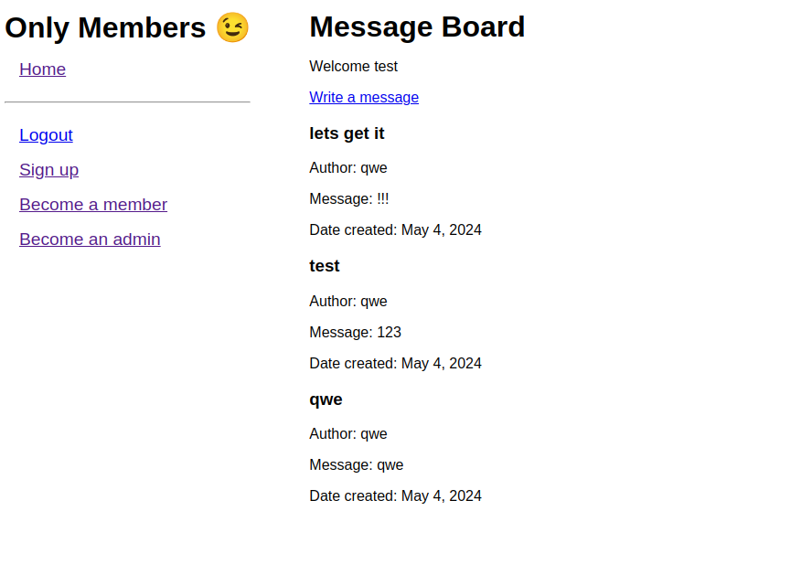

# members-only

This project is an example of MVC (Model-View-Controller) architecture and authentication using Passport.js. It demonstrates how to create a secure login system where users can register, log in, and access different routes based on their role (member or admin).

## Gain access

- Member password: member
- Admin password: admin

## Technologies Used

- Node.js
- Express.js
- Template engine (EJS)
- Passport (authentication)

Click [HERE](https://members-only-w8c4.onrender.com/ "Live members-only demo") for the live demo!

